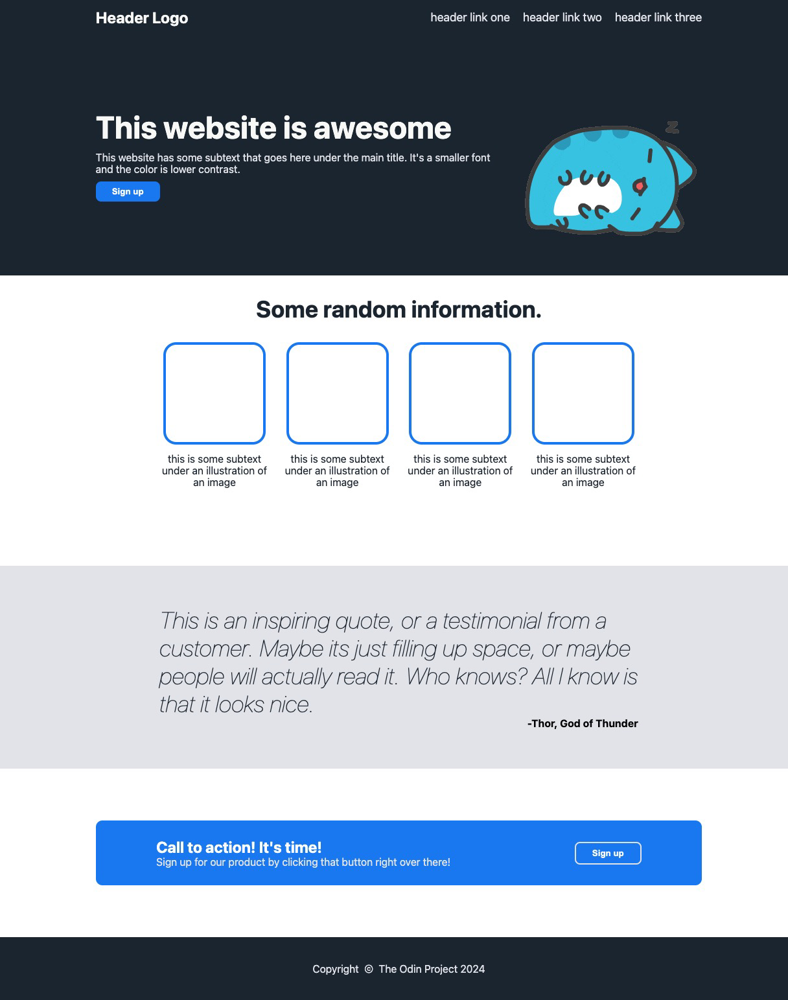

# Project: Landing Page

In this project, we are tasked with replicating a site with HTML and CSS with flexbox. I felt a lot more comfortable with flexbox and getting items to appear where I want them to be. Hoping to integrate JS soon!

## Site to be replicated

## Final Result 
